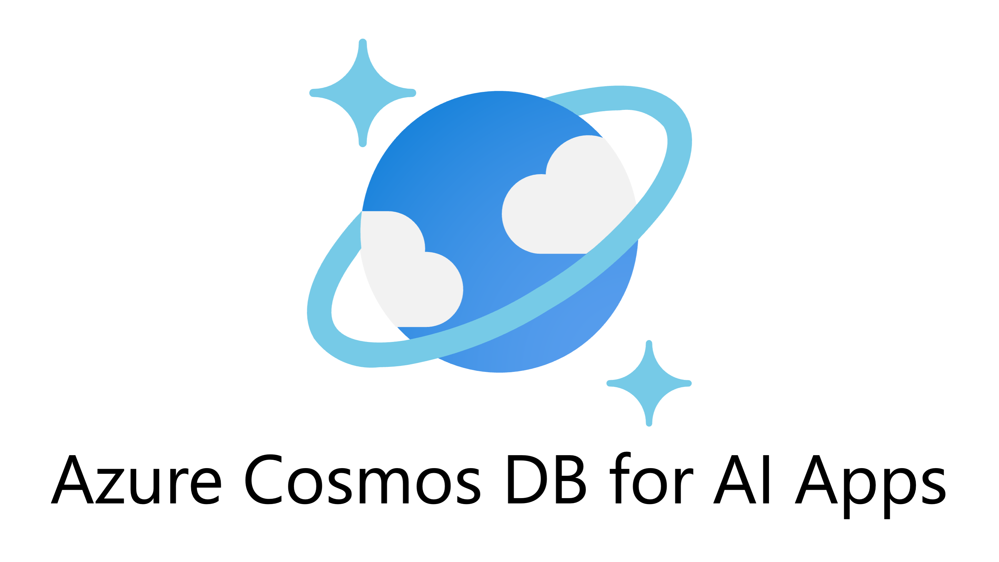

#

This is the official hub for demos, code, tutorials, videos, and documentation for using Azure Cosmos DB to build fast, scalable, and cost-effective AI applications.

## Documentation

**Introduction**

- [What is a vector database?](https://learn.microsoft.com/azure/cosmos-db/vector-database)
- [Concepts Overview](https://learn.microsoft.com/azure/cosmos-db/gen-ai/vector-search-overview)

**Azure Cosmos DB for NoSQL**

- [Vector Search in Azure Cosmos DB for NoSQL](https://learn.microsoft.com/azure/cosmos-db/nosql/vector-search)
- [Vector Indexing](https://learn.microsoft.com/azure/cosmos-db/index-policy#vector-indexes)
- [Managing Vector Indexes](https://learn.microsoft.com/azure/cosmos-db/nosql/how-to-manage-indexing-policy?tabs=dotnetv3%2Cpythonv3#vector-indexing-policy-examples)
- How to get started [C#](https://learn.microsoft.com/azure/cosmos-db/nosql/how-to-dotnet-vector-index-query), [Python](https://learn.microsoft.com/azure/cosmos-db/nosql/how-to-python-vector-index-query), [JavaScript](https://learn.microsoft.com/azure/cosmos-db/nosql/how-to-javascript-vector-index-query), [Java](https://learn.microsoft.com/azure/cosmos-db/nosql/how-to-java-vector-index-query)

**vCore-based Azure Cosmos DB for MongoDB**

- [Vector Search ](https://learn.microsoft.com/azure/cosmos-db/mongodb/vcore/vector-search)
- [RAG Example](https://learn.microsoft.com/en-us/azure/cosmos-db/mongodb/vcore/rag)

## Integrations

**Azure Cosmos DB for NoSQL**

- Semantic Kernel [C#](https://github.com/microsoft/semantic-kernel/tree/main/dotnet/src/Connectors/Connectors.Memory.AzureCosmosDBNoSQL), [Python](https://github.com/microsoft/semantic-kernel/tree/main/python/semantic_kernel/connectors/memory/azure_cosmosdb_no_sql) 
- LangChain [Python](https://python.langchain.com/v0.2/docs/integrations/vectorstores/azure_cosmos_db_no_sql/), JS (Coming soon!)
- LlamaIndex (Coming soon!)

**vCore-based Azure Cosmos DB for MongoDB**

- Semantic Kernel [C#](https://github.com/microsoft/semantic-kernel/tree/main/dotnet/src/Connectors/Connectors.Memory.AzureCosmosDBMongoDB), [Python](https://github.com/microsoft/semantic-kernel/tree/main/python/semantic_kernel/connectors/memory/azure_cosmosdb)
- LangChain [Python](https://python.langchain.com/v0.2/docs/integrations/vectorstores/azure_cosmos_db/)
- LlamaIndex [Python](https://docs.llamaindex.ai/en/stable/examples/vector_stores/AzureCosmosDBMongoDBvCoreDemo/)
- PromptFlow plugin [Python](https://github.com/microsoft/pf-azuredb)

## Developer Blog Articles

- [Introducing Vector Database capabilities in Azure Cosmos DB for NoSQL](https://devblogs.microsoft.com/cosmosdb/introducing-vector-database-capabilities-in-azure-cosmos-db-for-nosql/)
- [Vector Database in vCore-based Azure Cosmos DB for MongoDB now GA!](https://devblogs.microsoft.com/cosmosdb/mongodb-vcore-vector-search/)

## Code Samples

**Azure Cosmos DB for NoSQL**

- Build a Copilot sample app
  - This sample application shows how to build a Generative-AI application using Azure Cosmos DB for NoSQL using its new vector search capabilities and Azure OpenAI Service and Semantic Kernel. The sample provides practical guidance on many concepts you will need to design and build these types of applications.
    - Azure App Service
    - C#, Native SDK, Semantic Kernel
    - [Sample App](https://github.com/AzureCosmosDB/cosmosdb-nosql-copilot)
    - [Hands on Lab](https://github.com/AzureCosmosDB/cosmosdb-nosql-copilot/tree/start)
- Build a Copilot sample app - Azure Cosmos DB for MongoDB
  - This sample application shows how to build a Generative-AI application using Azure Cosmos DB for MongoDB using its  vector search capabilities and Azure OpenAI Service and Semantic Kernel. The sample provides practical guidance on many concepts you will need to design and build these types of applications.
    - Azure App Service
    - C#, Native SDK, Semantic Kernel
    - [Sample App](https://github.com/AzureCosmosDB/cosmosdb-mongo-copilot)
    - [Hands on Lab](https://github.com/AzureCosmosDB/cosmosdb-mongo-copilot/tree/start)
- Build your own Copilot End to End Solution Accelerator
  - Production Ready Reference Solution for how to build your own copilot using Azure services including: Azure Cosmos DB for NoSQL, Azure OpenAI Service, Azure Kubernetes Service or Azure Container Apps. Uses Semantic Kernel plugins for OpenAI, Cosmos DB connectors, and semantic cache. Built in C#.
    - AKS or ACA, Container Registry, Managed Identity, Key Vault, Log Analytics, Azure Monitor
    - [Solution Accelerator](https://github.com/Azure/buildyourowncopilot)
    - [Hackathon Workshop](https://github.com/microsoft/WhatTheHack)
- Movie ChatBot for Azure Cosmos DB for NoSQL
  - In this sample, we'll demonstrate how to build a RAG (Retrieval Augmented Generation) pattern application using a subset of the popular Movie Lens 1M dataset. This sample performs RAG over movie data with vector search, stores conversational chat history, and leverages a semantic cache, all using Azure Cosmos DB and its built-in vector search capability. Azure OpenAI Service is used to generate embeddings and LLM completions.
    - Jupyter Notebook
    - Python
    - [Sample App](https://github.com/AzureCosmosDB/Fabric-Conf-2024-Build-AI-Apps)
- LangChain integration with Azure Cosmos DB for NoSQL
  - This sample shows ingesting PDF's into Azure Cosmos DB for NoSQL and doing vector similarity search (RAG Pattern) using Langchain.
    - Jupyter Notebook
    - Python gradio
    - [Code](https://github.com/microsoft/AzureDataRetrievalAugmentedGenerationSamples/blob/main/Python/CosmosDB-NoSQL-Integrations/LangChain-CosmosDBNoSQL-AzureOpenAI.ipynb)

**vCore-based Azure Cosmos DB for MongoDB**

- Movie ChatBot for Azure Cosmos DB for MongoDB
  - In this sample, we'll demonstrate how to build a RAG (Retrieval Augmented Generation) pattern application using a subset of the popular Movie Lens 1M dataset. This sample performs RAG over movie data with vector search, stores conversational chat history, and leverages a semantic cache, all using Azure Cosmos DB and its built-in vector search capability. Azure OpenAI Service is used to generate embeddings and LLM completions.
    - Jupyter Notebook
    - Python
    - [Sample App](https://github.com/AzureCosmosDB/Fabric-Conf-2024-Build-AI-Apps)

- Cosmic RAG Food app with Langchain, Azure OpenAI and Azure Cosmos DB for MongoDB (vCore)
  - A Demo application for a streamlined ordering system tailored for various food categories. It allows users to request customized meals, such as "high protein dishes," with recommendations provided from our database. Users can further customize their choices before sending their orders from the app to the restaurant, including delivery details.
    - Jupyter Notebook
    - Web app
    - [Code](https://github.com/Azure-Samples/Cosmic-Food-RAG-app)
- Advertisement generation with Azure OpenAI and vCore-based Azure Cosmos DB for MongoDB
  - This project demonstrates the use of Azure Cosmos DB's vCore's vector similarity search and OpenAI embeddings to generate advertising content aimed at boosting sales. It is particularly tailored for a shoe retailer looking to leverage recent trends for effective advertising.
    - Jupyter Notebook
    - Python gradio
    - [Code](https://aka.ms/adgen)

- LangChain integration with vCore-based Azure Cosmos DB for MongoDB
  - This sample shows ingesting PDF's into Azure Cosmos DB and doing vector similarity search (RAG Pattern) using Langchain.
    - Jupyter Notebook
    - Gradio
    - [Code](https://github.com/microsoft/AzureDataRetrievalAugmentedGenerationSamples/blob/main/Python/CosmosDB-MongoDB-vCore-Integrations/LangChain-CosmosDBMongovCoreVectorSearch-AzureOpenAI.ipynb)

## Videos

**Azure Cosmos DB for NoSQL**

- [What is the database behind ChatGPT? | Microsoft Mechanics](https://www.youtube.com/watch?v=6IIUtEFKJec)
- [AI Semantic Search for Your Website with Azure Cosmos DB | Microsoft Mechanics](https://www.youtube.com/watch?v=3T0K61VbnFw)
- [Vector Search using 95% Less Compute with DiskANN and Azure Cosmos DB | Microsoft Mechanics](https://www.youtube.com/watch?v=MlMPIYONvfQ)
- [Scalable RAG with Azure Cosmos DB and DiskANN | Studio15, Microsoft Build 2024](https://www.youtube.com/watch?v=-UkHbToopc4)
- [The power of AI and Copilot for Azure Databases | BRK171, Build 2024](https://www.youtube.com/watch?v=6VUfsY0kRxA)
- [Build Scalable Chat History and Conversational Memory into LLM Apps](https://www.youtube.com/watch?v=-m2ymy1Zyq8)
- [Azure Cosmos DB: The database for your AI apps | Azure Friday](https://www.youtube.com/watch?v=YYYrz0i2-Ao)
- [Azure Cosmos DB with DiskANN - Quick Demo](https://www.youtube.com/watch?v=u0ulNfZAxgc)
- [How to design and build AI applications with vector search using Azure OpenAI & Azure Cosmos DB | SQLBits](https://www.youtube.com/watch?v=KuslX-Aw5sQ)
- [Azure Cosmos DB for NoSQL and OpenAI: Building Robust Applications with RAG pattern](https://www.youtube.com/watch?v=E3okcKvpvHo)
- [Coffee 26: Vector Search with Azure Cosmos DB: Next-generation applications made easy](https://www.youtube.com/watch?v=pAt6flNRabk&pp=ygUZImNvc21vcyBkYiIgdmVjdG9yIHNlYXJjaA%3D%3D)
- [Building Generative AI Apps with Azure Cosmos DB for NoSQL](https://www.youtube.com/watch?v=eAbYC7B-NPo)

**vCore-based Azure Cosmos DB for MongoDB**

- [What is vector search? - vCore-based Azure Cosmos DB for MongoDB](https://www.youtube.com/watch?v=1YRvqzxXu68)
- [Applying GenAI and Azure Cosmos DB for MongoDB Vector Search to Interactive Analytics & Reporting](https://www.youtube.com/watch?v=-AynwwU7JUo)
- [Build next gen intelligent retail with Azure OpenAI & vCore-based Azure Cosmos DB for MongoDB)](https://www.youtube.com/watch?v=6Qyl_pnIwh4)
- [LLM App Development Using PromptFlow and Azure Cosmos DB for MongoDB](https://www.youtube.com/watch?)
- [Connecting a RAG chat app to Azure Cosmos DB](https://www.youtube.com/watch?v=cpbzQ-PfC4Y&pp)
[Building a Chat Bot using data in Azure Cosmos DB for MongoDB vCore in Azure AI Studio | Ep. 88, Cosmos DB TV](https://www.youtube.com/watch?v=9X0td5CoYmE)
- [Build AI-powered apps with Azure Cosmos DB for MongoDB vector search | Ep. 93, Cosmos DB TV](https://www.youtube.com/watch?v=MLY5Pc_tSXw&ppD)
- [CosmosAIGraph - AI-powered Graphs and Knowledge Graphs with Azure Cosmos DB | Ep. 95, Cosmos DB TV](https://www.youtube.com/watch?v=0alvRmEgIpQ)
- [Unlock the Power of Azure Cosmos DB for MongoDB vCore: An Interactive Session for Startups](https://www.youtube.com/watch?v=ehzz0Uhuvc4&pp)
- [RAG using Semantic Kernel with Azure OpenAI and Azure Cosmos DB for MongoDB vCore](https://www.youtube.com/watch?v=XHJj_M84X28)
  